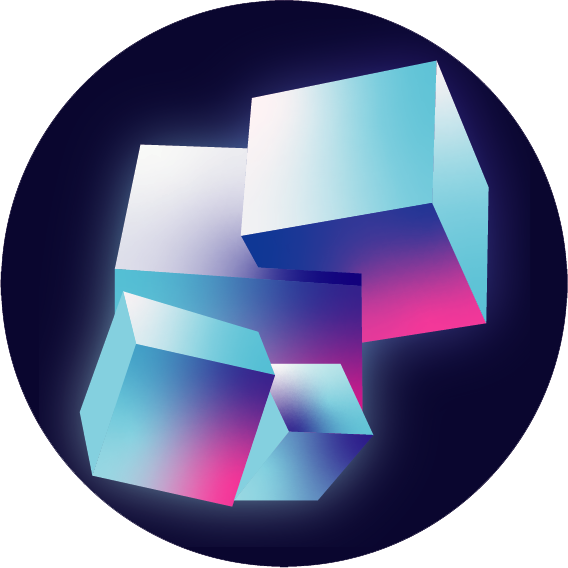

<p align="left" style="display: flex; gap: 16px; align-items: center;">
	
	
</p>

# Eido-Fix
## Description
### English
Eido-Fix is a mod that brings bug fixes or changes unwanted behaviors in the game.

### Français
Eido-Fix est un mod qui apporte des bugfix ou des changement de comportements non souhaités dans le jeu.

## Advertisement
### English
As mentioned above, Eido-Fix is part of the Eido project mod collection. If you are interested in following the development of the Eido meta-project, feel free to join our server.

### Français
Comme indiqué plus haut, Eido-Fix fait partie de la collection de mods du projet Eido. Si vous êtes intéressé par le suivi du développement du méta-projet Eido, je vous invite à rejoindre notre serveur.

### Media
Still with the old name,
- WebSite : https://mc.berryblue.fr/
- Discord : https://discord.gg/brwbTkNnTx

<!-- ## Showcase

<table>
	<tr>
		<td align="center">
			
		</td>
		<td align="center">
			
		</td>
	</tr>
	<tr>
		<td align="center">
			
		</td>
		<td align="center">
			
		</td>
	</tr>
</table> -->

## Change List

```

java/
  └─ Agriculture
        ├─ Plant needs to view sky to grow
		├─ Plant grow only in 25% of the case
		└─ Bone meal only work in 30% of use
  └─ Transportation
        └─ Elytra canot be wear anymore
	
resources/
  └─ loot_table 
        ├─ removing iron drop from iron golem
        ├─ removing iron drop from iron zombie
        ├─ removing iron drop from iron zombie villager
        └─ removing gold drop from iron piglin
```

If you want, I can expand any of the subfolders above into a full file list (for example, list every file under `assets/eidoplants/blockstates/` or every class in `fr.Eidolyth`).

## Contribution
1. Create a dedicated branch for each new feature or bug fix.
2. Commit your changes with clear and detailed messages.
3. Make sure to follow the project's [Git syntax](doc/gitSyntax.md).
4. Submit a pull request for review by another team member.

## Authors
- Samuel Chapuis (Thorid4n) — Project Lead

## Acknowledgments
This section recognizes the main contributors to the project and their roles.

- Avixy — Developer
- Fabrice Lozac'h (Fab0uu) — Network Developer

## License
This project is licensed under the MIT License.
You are free to use, modify, and distribute this software with proper attribution.

See [LICENSE](LICENSE) for details.